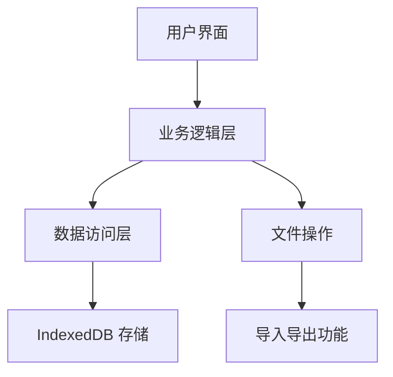

# GearKeep 网页端设计文档

## 1. 项目概述

GearKeep 网页端是一款专为摄影师和数码爱好者设计的纯本地、隐私安全的器材管理工具。它允许用户在浏览器中管理他们的摄影器材和电子产品，支持物品管理、资产统计、保修追踪等核心功能。

### 1.1 核心目标

- 提供纯本地的器材管理解决方案
- 支持数据导入导出功能
- 实现与 Android 端类似的核心功能
- 提供现代化、响应式的用户界面
- 支持深色模式和多种视图模式

### 1.2 技术约束

根据项目规范，网页端将使用以下技术栈：

- **前端框架**：Next.js (App Router)
- **编程语言**：TypeScript
- **UI 框架**：React
- **样式方案**：Tailwind CSS v4
- **UI 组件库**：shadcn/ui
- **存储方案**：IndexedDB (使用 idb 库)
- **文件操作**：File System Access API

## 2. 架构设计

### 2.1 整体架构

GearKeep 网页端采用前端单页应用架构，所有数据存储在浏览器本地，无需后端服务。



### 2.2 模块划分

- **UI 层**：负责渲染用户界面，处理用户交互
- **业务逻辑层**：处理核心业务逻辑，如物品管理、统计计算等
- **数据访问层**：负责与 IndexedDB 交互，提供数据持久化
- **工具层**：提供通用工具函数，如日期处理、格式化等

### 2.3 数据流

1. 用户通过 UI 层发起操作（如添加物品）
2. 业务逻辑层处理请求，调用数据访问层
3. 数据访问层与 IndexedDB 交互，执行数据操作
4. 数据变更后，UI 层更新视图

## 3. 数据模型

### 3.1 核心实体

#### Item (物品)

| 字段名 | 类型 | 描述 |
|-------|------|------|
| id | string (UUID) | 唯一标识符 |
| name | string | 物品名称 |
| brand | string | 品牌 |
| model | string | 型号 |
| sn | string | 序列号 |
| purchasePrice | number | 购入价格 |
| purchaseDate | number (timestamp) | 购入日期 |
| warrantyMonths | number | 保修月数 |
| warrantyDeadline | number (timestamp) | 保修截止日期 |
| location | string | 存放位置 |
| notes | string | 备注 |
| isMaster | boolean | 是否为主设备 |
| createdAt | number (timestamp) | 创建时间 |
| updatedAt | number (timestamp) | 更新时间 |

#### Relationship (关系)

| 字段名 | 类型 | 描述 |
|-------|------|------|
| id | string (UUID) | 唯一标识符 |
| parentId | string (UUID) | 父物品 ID |
| childId | string (UUID) | 子物品 ID |
| createdAt | number (timestamp) | 创建时间 |

### 3.2 存储结构

- **items**：存储所有物品
- **relationships**：存储物品之间的关系
- **settings**：存储应用设置（如主题偏好）

## 4. 功能设计

### 4.1 核心功能

#### 4.1.1 物品管理
- 添加新物品
- 编辑现有物品
- 删除物品
- 查看物品详情
- 物品分类管理

#### 4.1.2 资产统计
- 总物品数统计
- 总资产价值计算
- 分类价值统计
- 价值趋势分析

#### 4.1.3 搜索过滤
- 关键词搜索
- 按品牌、型号、分类过滤
- 按价格范围过滤
- 按购买日期过滤

#### 4.1.4 图片管理
- 上传物品图片
- 图片预览
- 图片管理（删除、替换）

#### 4.1.5 数据导入导出
- 导出为 .gearbak 文件
- 导入 .gearbak 文件
- 冲突处理

#### 4.1.6 器材配套
- 主设备与配件关联
- 配套视图展示
- 快捷添加/解绑配件

#### 4.1.7 保修管理
- 保修看板
- 保修到期提醒
- 保修状态跟踪

### 4.2 辅助功能

- **主题切换**：亮色/暗色模式
- **视图切换**：卡片视图/列表视图
- **响应式设计**：适配不同屏幕尺寸
- **本地存储**：数据持久化到 IndexedDB

## 5. 页面设计

### 5.1 页面结构

#### 5.1.1 导航栏
- Logo 和应用名称
- 导航链接（首页、器材库、设置）
- 主题切换按钮
- 添加物品按钮

#### 5.1.2 首页 (Dashboard)
- 统计卡片（总物品数、总资产价值、保修中物品）
- 保修看板（即将到期、已过保物品）
- 最近添加物品列表

#### 5.1.3 器材库 (Inventory)
- 搜索和过滤功能
- 视图切换（卡片/列表）
- 物品列表
- 分类筛选

#### 5.1.4 添加/编辑物品页
- 物品信息表单
- 图片上传
- 保存/取消按钮

#### 5.1.5 物品详情页
- 物品基本信息
- 保修信息
- 关联配件列表
- 图片展示
- 编辑/删除按钮

#### 5.1.6 设置页
- 导入/导出功能
- 数据管理
- 应用设置（主题、视图等）

### 5.2 UI 设计

#### 5.2.1 配色方案

- **主色调**：蓝色 (#3b82f6) - 代表专业、信任
- **辅助色**：绿色 (#10b981) - 用于成功状态
- **警告色**：黄色 (#f59e0b) - 用于警告状态
- **危险色**：红色 (#ef4444) - 用于错误状态
- **中性色**：白色、灰色系列 - 用于背景和文本

#### 5.2.2 排版

- **标题**：Inter, 18-24px, 600-700 weight
- **正文**：Inter, 14-16px, 400-500 weight
- **按钮文本**：Inter, 14px, 500 weight
- **辅助文本**：Inter, 12-14px, 400 weight

#### 5.2.3 组件设计

- **卡片**：圆角 8px，轻微阴影，悬停效果
- **按钮**：圆角 6px，填充式和轮廓式
- **输入框**：圆角 6px，边框样式
- **表格**：交替行背景，悬停高亮
- **徽章**：圆角 9999px，小型标签

## 6. 存储方案

### 6.1 IndexedDB

使用 `idb` 库封装 IndexedDB 操作，提供更友好的 API：

- **数据库名称**：`gearkeeper-web`
- **版本**：1
- **存储对象**：
  - `items`：存储物品数据
  - `relationships`：存储关系数据
  - `settings`：存储应用设置

### 6.2 导入导出

- **导出**：将 IndexedDB 数据导出为 JSON，与图片一起打包为 .gearbak 文件
- **导入**：读取 .gearbak 文件，解压后解析 JSON 数据，导入到 IndexedDB
- **冲突处理**：当导入的数据与本地数据冲突时，提供覆盖、保留或新增选项

## 7. 实现计划

### 7.1 项目初始化

1. 创建 Next.js 项目
2. 配置 TypeScript
3. 安装 Tailwind CSS v4
4. 配置 shadcn/ui
5. 安装必要的依赖（idb、uuid 等）

### 7.2 核心功能实现

1. **数据存储层**：实现 IndexedDB 操作
2. **业务逻辑层**：实现物品管理、统计计算等功能
3. **UI 组件**：实现基础 UI 组件
4. **页面实现**：
   - 首页
   - 器材库
   - 添加/编辑物品页
   - 物品详情页
   - 设置页
5. **导入导出功能**：实现 .gearbak 文件的导入导出

### 7.3 辅助功能实现

1. **主题切换**：实现亮色/暗色模式
2. **视图切换**：实现卡片/列表视图
3. **响应式设计**：优化不同屏幕尺寸的布局
4. **图片管理**：实现图片上传和预览

### 7.4 测试和优化

1. 功能测试
2. 性能优化
3. 兼容性测试
4. 用户体验优化

## 8. 技术要点

### 8.1 Tailwind CSS v4

- 使用 `@theme` 指令在 `globals.css` 中配置主题
- 遵循 Tailwind v4 的最佳实践
- 避免使用旧版 Tailwind 的配置逻辑

### 8.2 Next.js App Router

- 默认使用 Server Components
- 仅在需要交互时使用 `"use client"`
- 保持 Client Components 在组件树的叶子节点

### 8.3 shadcn/ui

- 使用基于 Radix UI 的 shadcn/ui 组件
- 按照规范添加新组件

### 8.4 性能优化

- 惰性加载非关键组件
- 优化图片加载
- 减少不必要的重渲染
- 使用 React.memo 和 useCallback 优化性能

### 8.5 安全性

- 所有数据存储在本地，无需网络请求
- 不收集用户数据
- 确保文件操作的安全性

## 9. 项目结构

```
frontend/
├── app/
│   ├── globals.css          # 全局样式（Tailwind v4 配置）
│   ├── layout.tsx           # 根布局
│   ├── page.tsx             # 首页（Dashboard）
│   ├── inventory/           # 器材库
│   │   └── page.tsx
│   ├── add-item/            # 添加物品
│   │   └── page.tsx
│   ├── item/                # 物品详情
│   │   └── [id]/page.tsx
│   └── settings/            # 设置页
│       └── page.tsx
├── components/
│   ├── ui/                  # shadcn/ui 组件
│   │   ├── button.tsx
│   │   ├── card.tsx
│   │   ├── input.tsx
│   │   └── ...
│   ├── layout/              # 布局组件
│   │   ├── Navbar.tsx
│   │   └── Footer.tsx
│   └── feature/             # 功能组件
│       ├── StatCard.tsx
│       ├── ItemCard.tsx
│       ├── WarrantyBoard.tsx
│       └── ...
├── lib/
│   ├── storage/             # 存储相关
│   │   ├── indexeddb.ts     # IndexedDB 操作
│   │   └── import-export.ts  # 导入导出逻辑
│   ├── types/               # TypeScript 类型
│   │   └── index.ts
│   └── utils/               # 工具函数
│       ├── date.ts
│       ├── format.ts
│       └── ...
├── public/                  # 静态资源
├── package.json
├── tsconfig.json
└── next.config.js
```

## 10. 结论

GearKeep 网页端将提供一个现代化、功能完整的器材管理解决方案，与 Android 端形成互补。通过纯本地存储和导入导出功能，用户可以在不同设备间同步数据，同时保持数据的隐私和安全。

设计采用了现代化的技术栈和 UI 设计，确保良好的用户体验和性能。项目结构清晰，代码组织合理，便于维护和扩展。